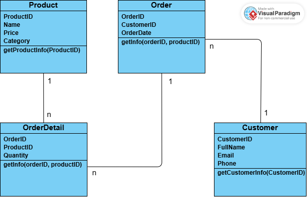
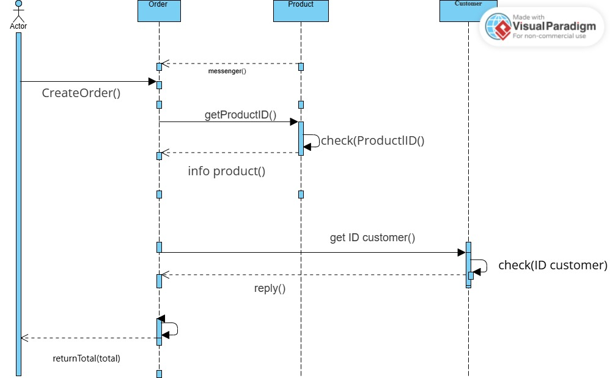

# Project Nhóm DucManh_HaiAnh_DucViet_OOP_N04

## Thành viên

1. **Lê Hoàng Đức Mạnh**  
   ID: 23010456

2. **Đỗ Đức Việt**  
   ID: 23010382

3. **Lê Nguyễn Hải Anh**  
   ID: 23010006

## Nội dung dự án

**Project:** Xây dựng ứng dụng quản lý Sản phẩm & Đơn hàng

**Yêu cầu chính:**

- Giao diện **Java Spring Boot**
- Có chức năng quản lý sản phẩm, khách hàng, đơn hàng
- Và các chức năng khác

## Chức năng chi tiết

### Quản lý sản phẩm

- Thêm, sửa, xoá sản phẩm
- Liệt kê sản phẩm, lọc theo tên, loại, giá

### Quản lý khách hàng

- Thêm, sửa, xoá khách hàng
- Liệt kê khách hàng, tìm kiếm theo tên / email / số điện thoại

### Quản lý đơn hàng

- Tạo đơn hàng + chi tiết đơn hàng
- Gán sản phẩm theo số lượng
- Tính tổng tiền tự động

## Lưu trữ dữ liệu

- Lưu xuống file nhị phân (`.dat`, `.bin`)
- Các lớp chính:
  - `Product`
  - `Customer`
  - `Order`
  - `OrderDetail`
- Trong RAM sử dụng `ArrayList`, `Map`, ...

## Sơ đồ UML

### 1.1 UML Class Diagram

### 1.2 UML Sequence Diagram

