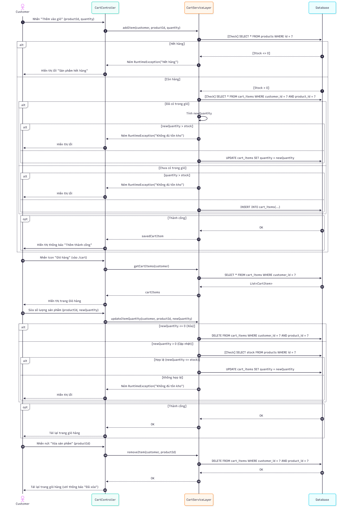

# Dự án Lập trình Hướng đối tượng của Nhóm 3: Xây dựng website thương mại điện tử Mộc E-Commerce
# Link online: https://moc-e-commerce.as.r.appspot.com/

## Thành viên Nhóm 3

1.  **Lê Hoàng Đức Mạnh** - *23010456* - *K17-KHMT_1*
2.  **Đỗ Đức Việt** - *23010382* - *K17-KHMT_1*
3.  **Lê Nguyễn Hải Anh** - *23010006* - *K17-KHMT_1*

---

## Nội dung [Content]

Xây dựng ứng dụng website thương mại điện tử Mộc E-commerce sử dụng Java Spring Boot, cho phép người dùng xem sản phẩm, quản lý giỏ hàng, đặt hàng và quản lý thông tin cá nhân.

---

## Yêu cầu chính [Main Features]

* **Giao diện:** Xây dựng giao diện người dùng web thân thiện sử dụng Thymeleaf, HTML, CSS, và JavaScript.
* **Quản lý Sản phẩm:**
    * Hiển thị danh sách sản phẩm theo danh mục, sản phẩm mới, bán chạy, gợi ý,...
    * Xem chi tiết thông tin sản phẩm.
* **Quản lý Giỏ hàng:**
    * Thêm sản phẩm vào giỏ.
    * Xem giỏ hàng.
    * Cập nhật số lượng sản phẩm.
    * Xóa sản phẩm khỏi giỏ.
    * Áp dụng mã giảm giá (GIAM10).
* **Quản lý Tài khoản Khách hàng:**
    * Đăng ký, đăng nhập, đăng xuất.
    * Xem và quản lý thông tin cá nhân.
    * Đổi mật khẩu.
    * Quản lý sổ địa chỉ (thêm, sửa, xóa, đặt làm mặc định).
    * Xem lịch sử đơn hàng.
    * Xóa tài khoản.
* **Thanh toán (Checkout):**
    * Điền thông tin giao hàng, chọn phương thức vận chuyển, thanh toán (COD, VNPay).
    * Xác nhận và đặt hàng.
    * Hiển thị trang xác nhận đơn hàng thành công.
* **Cơ sở dữ liệu:** Sử dụng MySQL kết nối qua Railway để lưu trữ thông tin người dùng, sản phẩm, đơn hàng,...

---

## Công nghệ sử dụng [Technologies Used]

* **Backend:** Java 17, Spring Boot 3.5.6
    * Spring Web
    * Spring Data JPA
    * Hibernate
* **Frontend:** Thymeleaf, HTML5, CSS3, JavaScript
* **Database:** MySQL (Kết nối qua Railway)
* **Build Tool:** Maven

---

## Sơ đồ UML [UML Diagrams]

### 1. Sơ đồ lớp [Class Diagram]

### 2. Sơ đồ trình tự [Sequence Diagrams]

* **Quản lý Tài khoản:**
    
* **Quản lý Địa chỉ:**
    
* **Quản lý Giỏ hàng:**
    
* **Chức năng chính - Đặt hàng:**
    

---

## Hướng dẫn cài đặt & Chạy [Setup & Run]
1.  Clone repository: `git clone <https://github.com/FeliksWatterson/OOP_NO4_25_26_DucManh_DucViet_HaiAnh>`
2.  Mở dự án bằng IDE (IntelliJ IDEA, Eclipse, VSCode...).
3.  Đảm bảo cấu hình file `application.properties` đúng với thông tin kết nối database MySQL.
4.  Chạy ứng dụng Spring Boot (chạy file `WebBanHangApplication.java`).
5.  Truy cập `http://localhost:8080`.
